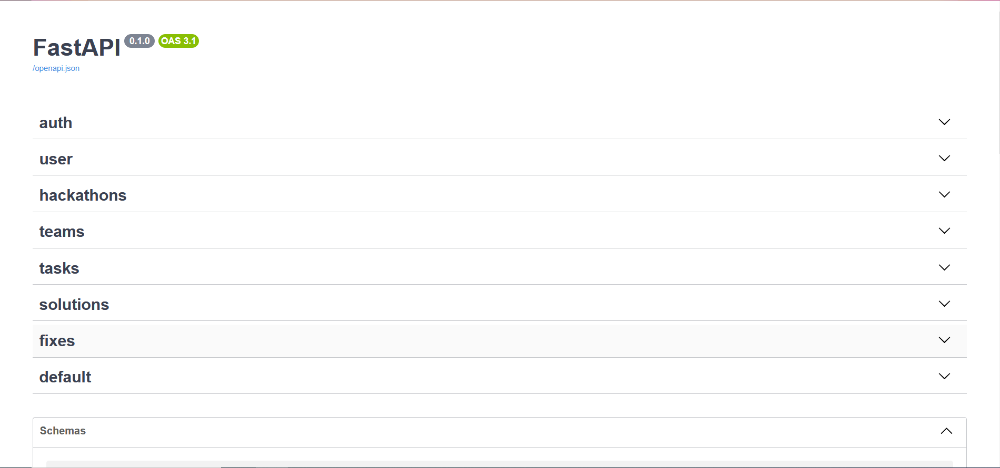
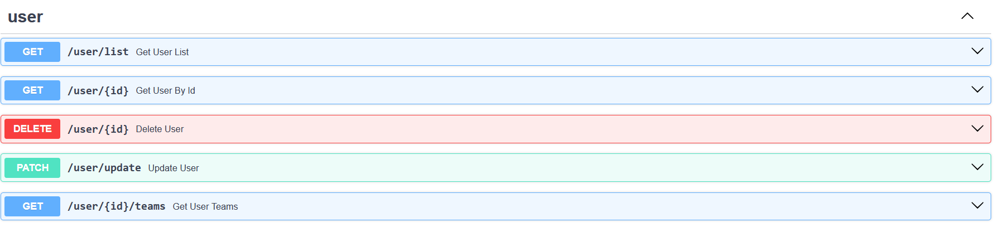
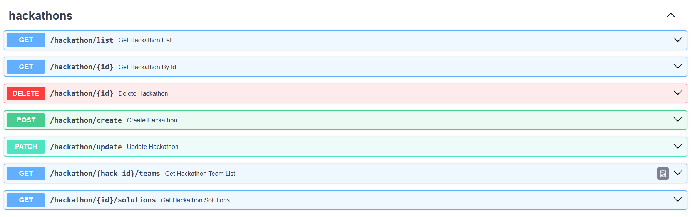
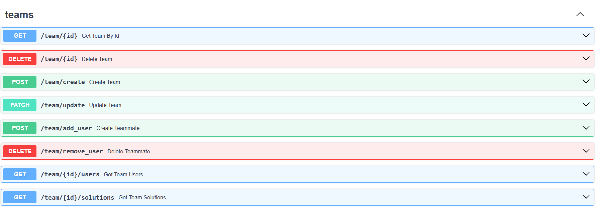
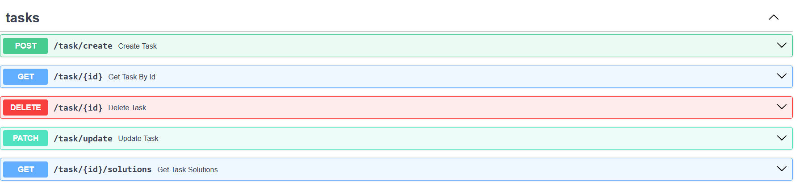
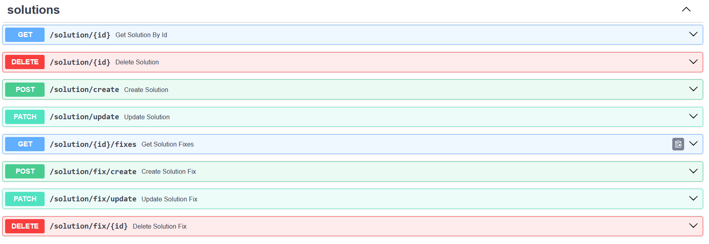

# API

Для взаимодействия с бекэнд был реализован API. С помощью средств библиотеки FastAPI были реализованы API-эндпоинты для взаимодействия с системой. Реализованы CRUD-операции над всеми моделями базы данных. Далее представлены вырезки из Swagger документации в приложении.

## Документация

## User

## Hackathon

## Team

## Task

## Solution/Fix

