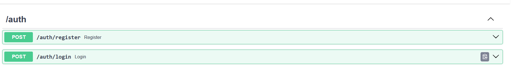
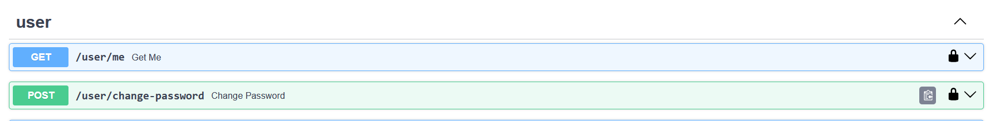

# Регистрация и авторизация

Была реализована возможность регистрации и авторизации пользователей в приложении.

Для этого были написаны вспомогательный функции, который выполняют различные действия при регистрации - создание токена, декодирование токена, хэширование пароля и другие.

```python
def get_password_hash(password):
    return pwd_context.hash(password)

def verify_password(password, hashed_password):
    return pwd_context.verify(password, hashed_password)

def encode_token(user_id, role):
    payload = {
        "exp": datetime.datetime.now(datetime.UTC) + datetime.timedelta(days=30),
        "user_id": user_id,
        "role": role.value
    }
    return jwt.encode(payload=payload, key=secret, algorithm="HS256")

def decode_token(token):
    try:
        payload = jwt.decode(jwt=token, key=secret, algorithms="HS256")
        return payload
    except jwt.ExpiredSignatureError:
        raise HTTPException(
                status_code=status.HTTP_401_UNAUTHORIZED, 
                detail="Expired Token"
            )

    except jwt.InvalidTokenError:
        raise HTTPException(
                status_code=status.HTTP_401_UNAUTHORIZED,
                detail="Invalid Token"
            )

def get_current_user(auth: HTTPAuthorizationCredentials = Security(security)):
    credentials_error = HTTPException(
        status_code=status.HTTP_401_UNAUTHORIZED,
        detail="Could not validate credentials"
    )

    payload = decode_token(auth.credentials)
    if not payload:
        raise credentials_error
    
    return payload

def get_current_user_id(auth: HTTPAuthorizationCredentials = Security(security)):
    payload = get_current_user(auth)
    try:
        return payload["user_id"]
    except KeyError:
        return None

def get_current_user_role(auth: HTTPAuthorizationCredentials = Security(security)):
    payload = get_current_user(auth)
    try:
        return payload["role"]
    except KeyError:
        return None
```

Далее был создан роутер для авторизации. Роутер содержит эндпоинты для регистрации и авторизации.


Также, были созданы пользовательские эндпоинты для получения информации о себе и изменения пароля. Для идентификации пользователя используется токен, полученный при авторизации.


