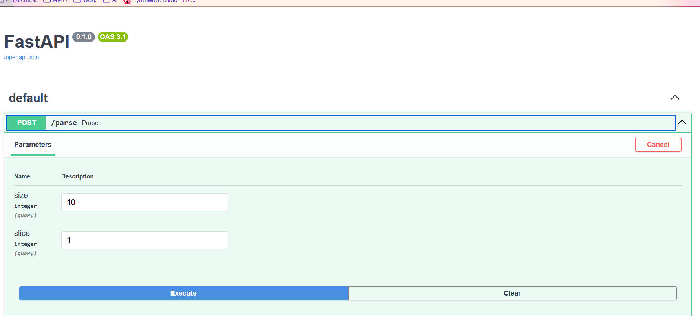
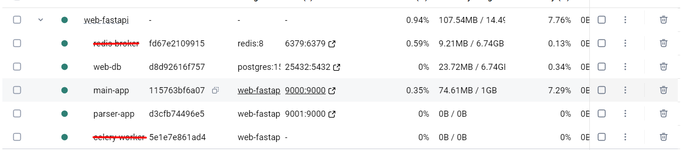
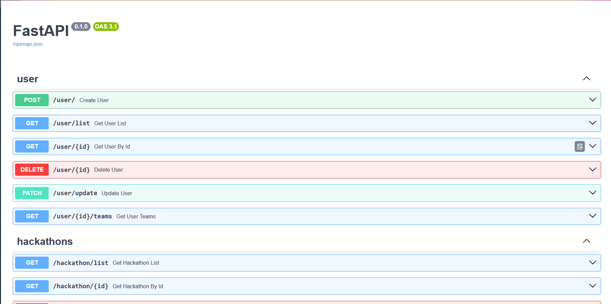

# Упаковка FastAPI приложения, базы данных и парсера данных в Docker

## Текст задания

1. Создать базу данных, FastAPI приложение и парсер данных (сделано до этого).
2. Внедрить вызов парсера в отдельное FastAPI приложение.
3. Разработать 2 Dockerfile-а для упаковки основного приложения и приложения парсерав контейнеры.
4. Создать docker-compose для развёртывания базы данных, и данных приложений

## Реализация

Было реализовано простое приложение для вызова парсера. Код метода скопирован из прошлой лабы, который использовался для замера времени.

```python
app = FastAPI()

@app.post("/parse")
async def parse(size: int=10, slice: int=1):
    urls = await async_get_urls(size, slice)
    tasks = []

    for url in urls:
        tasks.append(async_fetch_parse_load(url))

    await asyncio.gather(*tasks, return_exceptions=True)
    return {"ok": True}
```

Сваггер запущенного приложения:



Далее надо было упаковать приложения в контейнеры:

Основное приложение

```Dockerfile
FROM python:3.12-slim

WORKDIR /app

COPY requirements.txt .
RUN pip install --no-cache-dir -r requirements.txt

COPY app ./app
COPY migrations .
COPY alembic.ini .

EXPOSE 9000

CMD ["fastapi", "run", "app/app.py", "--port", "9000"]
```

Приложение парсера:

```Dockerfile
FROM python:3.12-slim

WORKDIR /app

COPY requirements.txt .
RUN pip install -r requirements.txt

COPY . .

EXPOSE 9001

CMD ["fastapi", "run", "app.py", "--port", "9000"]
```

Логика Dockerfile простая - создать рабочую директорию, загрузить зависимости, после чего загрузить в контейнер файлы приложения и запустить его.

Далее идёт docker-compose

```yaml
services:
  web-db:
    container_name: web-db
    image: postgres:15
    restart: always
    shm_size: 128mb
    env_file:
      - "app/.env"
    ports:
      - 25432:5432
    volumes:
      - pgdata:/var/lib/postgresql@15/data 

  main-app:
    container_name: main-app
    build: .
    restart: always
    depends_on:
      - web-db
    pids_limit: 500
    mem_limit: 1G
    cpus: 2
    ports:
      - 9000:9000

  parser-app:
    container_name: parser-app
    build: ./lr2
    restart: always
    depends_on:
      - web-db
      - redis-broker
    pids_limit: 500
    mem_limit: 1G
    cpus: 2
    ports:
      - 9001:9000

volumes:
  pgdata:
```

После запуска видем в docker desktop 3 живых контейнера и они доступны с localhost-а.




