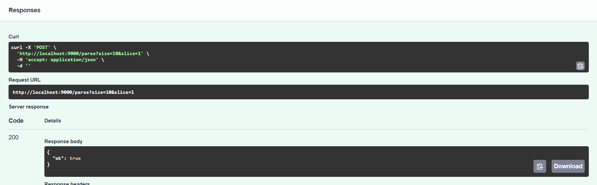

# Вызов парсера из FastAPI

## Текст задания

Создать эндпоинт для вызова парсера

## Реализация

Поскольку приложение парсера создано тоже FastAPI, то можно достучаться до него с помощью простого http запроса. Будем использовать библиотеку requests для отправки запросов приложению парсера.

Метод вызова парсера

```python
@app.post("/parse_url")
def parse_url(url: str):
    session = requests.Session()
    try:
        r = session.post("http://parser-app:9000/parse_url",
                         params={"url": url})
    except requests.exceptions.ConnectionError:
        return {"detail": "connection error"}
    
    if r.ok:
        return r.json()
    else:
        return {"ok": False}
```

Здесь, обращение идёт по имени контейнера - хост во внутренней сети докера, и по внутреннему открытому порту.

Проверяем работу эндпоинта:




