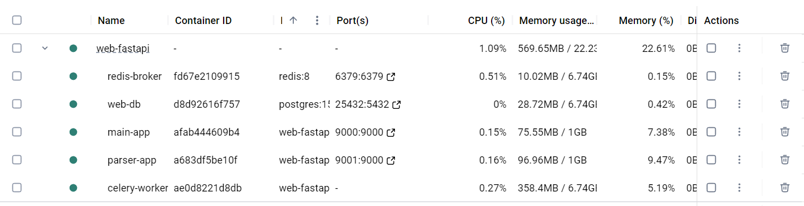
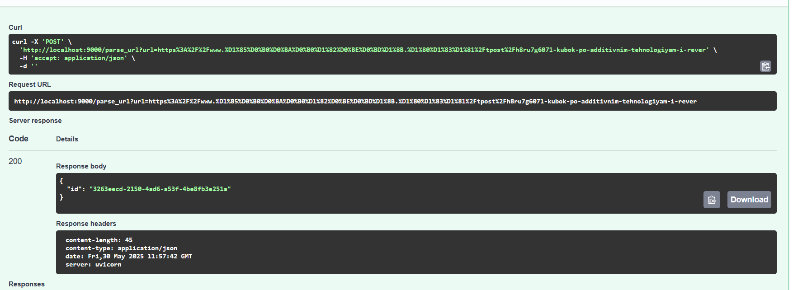
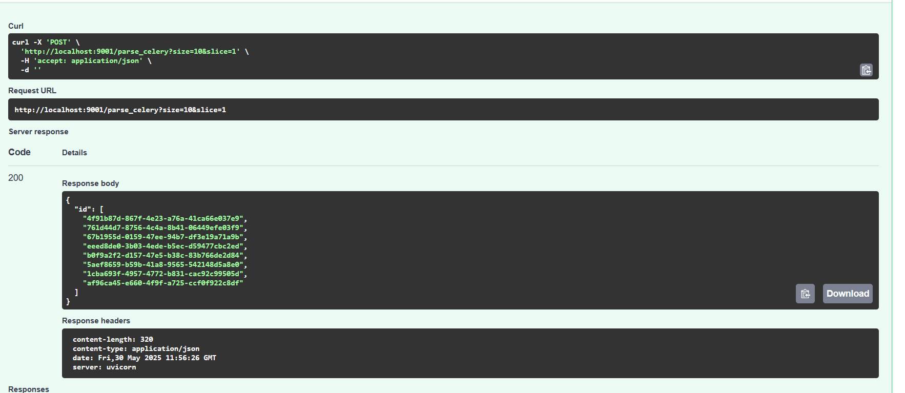
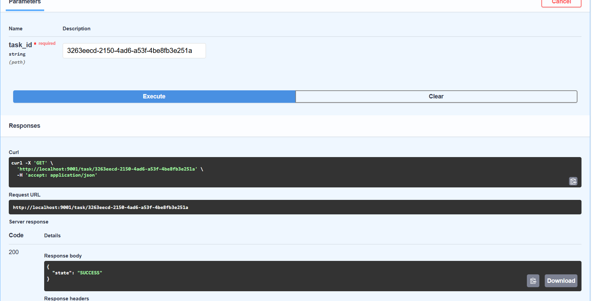
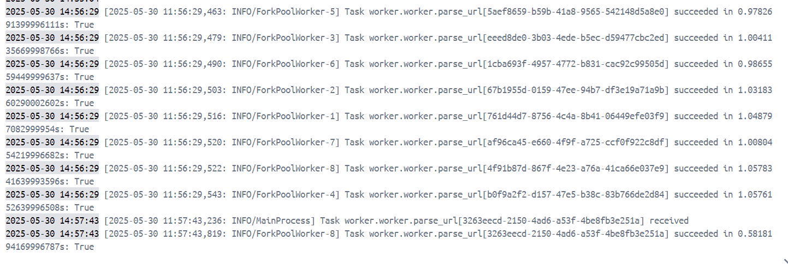

# Вызов парсера из FastAPI через очередь

## Текст задания

Установить и настроить Celery для создания очереди сообщений через Redis в качестве брокера.

## Реализация

Была добавлена зависимость celery.

```pip
pip install celery[redis]
```

Рядом с приложением парсера был создан celery worker, который будет обрабатывать запросы на создание новых задач и возвращать результаты работы. Redis выступает в качестве брокера и в качестве хранилища результатов.

```python
from celery import Celery
from dotenv import load_dotenv
from task2.parser import async_fetch_parse_load
import asyncio
import os

load_dotenv("app/.env")

redis_url = os.getenv("REDIS_URL", "redis://localhost:6379/0")
celery_app = Celery("worker", backend=redis_url, broker=redis_url)

@celery_app.task
def parse_url(url: str):
    return asyncio.run(async_fetch_parse_load(url))

celery_app.conf.task_routes = {
    "worker.parse_url": {"queue": "default"},
}
```

В приложение парсера были добавлены эндпоинты для добавления в очередь одного url-а, пачки url-ов, которые парсятся с сайта (так как это работало до этого, только сам парсер теперь вызывается в celery, а не ручками), а также эндпоинт для получения статуса задачи.

```python
@app.post("/parse_celery")
async def parse_celery(size: int=10, slice: int=1):
    urls = await async_get_urls(size, slice)
    ids = []
    for url in urls:
        task = parse_url.delay(url)
        ids.append(task.id)
    return {"id": ids}

@app.post("/parse_url")
async def parse_celery_single_url(url: str):
    task = parse_url.delay(url)
    return {"id": task.id}

@app.get("/task/{task_id}")
async def get_task_status(task_id: str):
    res = celery_app.AsyncResult(task_id)
    if res.state == "FAILURE":
        raise HTTPException(500, detail=str(res.result))
    return {"state": res.state}
```

Наконец, вызов эндпоинта для одного url-а из основного приложения.

```python
@app.post("/parse_url")
def parse_url(url: str):
    session = requests.Session()
    try:
        r = session.post("http://parser-app:9000/parse_url",
                         params={"url": url})
    except requests.exceptions.ConnectionError:
        return {"detail": "connection error"}
    
    if r.ok:
        return r.json()
    else:
        return {"ok": False}
```

Теперь надо добавить в композ 2 контейнера - redis и наш celery worker.

```Dockerfile
    redis-broker:
        container_name: redis-broker
        image: redis:8
        ports:
        - 6379:6379

  parser-app:
    container_name: parser-app
    build: ./lr2
    restart: always
    depends_on:
      - web-db
      - redis-broker
    pids_limit: 500
    mem_limit: 1G
    cpus: 2
    ports:
      - 9001:9000
    command: "fastapi run app.py --port 9000"

  celery-worker:
    container_name: celery-worker
    build: ./lr2
    restart: always
    depends_on:
      - parser-app
    command: celery -A worker.worker worker --loglevel=info
```

Редис билдится из готового образа с реестра. Celery воркер билдится тем же Dockerfile, что и приложение парсера, но из него был убран вызов команды fastapi. Теперь команда вызывается в композе.

Смотрим на поднятые контейнеры:



Проверяем работу:








